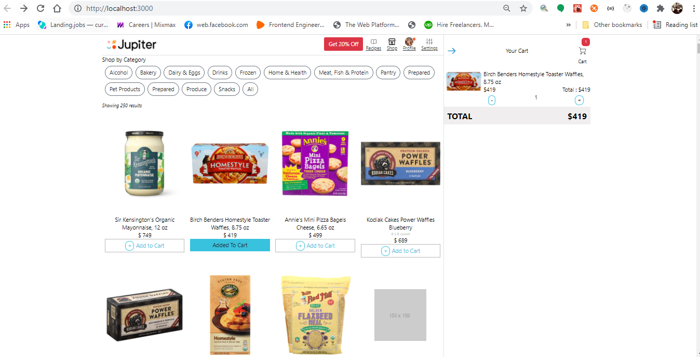
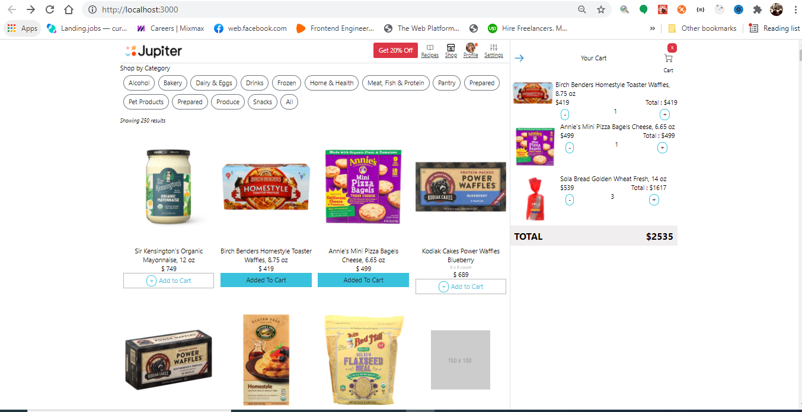
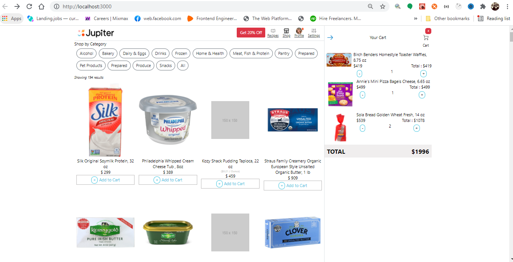
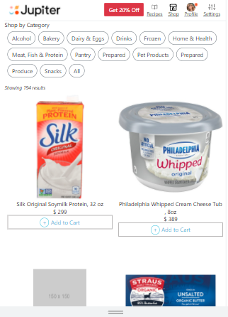

# SHOPPING CART APP

This is a Simple Shopping Cart App that I created with React TypeScript. All State is managed in the hooks, I didnot use any state manaement library since this is a small project, but it is something I am considering in thhe near future.

In this App you are able to see the following functionality

- By default , App displays all products
- You can sort you results by category , using the buttons on the top of the page
- You are able to view the number of results for your current search query
- You can add products to your cart
- You can remove products from your cart
- You are able to view total per product, and number of units of that product in the cart
- You are able to view the total number of units in your cart
- You are able to view the total cost of your entire cart
- Unknown routes are redirected to a custom Error page
- The App is fully mobile responsive, you can view it in your tad or mobile phone

## How to run this App

1. Clone this repo into your local development directory **_ git clone https://github.com/Edgar256/shopping-cart _**
2. Check into the directory **_ cd shopping-cart _**
3. Instal Node Modules using your preferred package manager, npm or yarn **_ npm install _**
4. Run the start scripts using **_ npm run start _**
5. Open your local server in the browser on Port 3000 **_ http://localhost:3000/ _**

### `npm test`

Launches the test runner in the interactive watch mode.\
See the section about [running tests](https://facebook.github.io/create-react-app/docs/running-tests) for more information.

### `npm run build`

Builds the app for production to the `build` folder.\
It correctly bundles React in production mode and optimizes the build for the best performance.

The build is minified and the filenames include the hashes.\
Your app is ready to be deployed!

See the section about [deployment](https://facebook.github.io/create-react-app/docs/deployment) for more information.

### `npm run eject`

**Note: this is a one-way operation. Once you `eject`, you can’t go back!**

If you aren’t satisfied with the build tool and configuration choices, you can `eject` at any time. This command will remove the single build dependency from your project.

Instead, it will copy all the configuration files and the transitive dependencies (webpack, Babel, ESLint, etc) right into your project so you have full control over them. All of the commands except `eject` will still work, but they will point to the copied scripts so you can tweak them. At this point you’re on your own.

You don’t have to ever use `eject`. The curated feature set is suitable for small and middle deployments, and you shouldn’t feel obligated to use this feature. However we understand that this tool wouldn’t be useful if you couldn’t customize it when you are ready for it.
